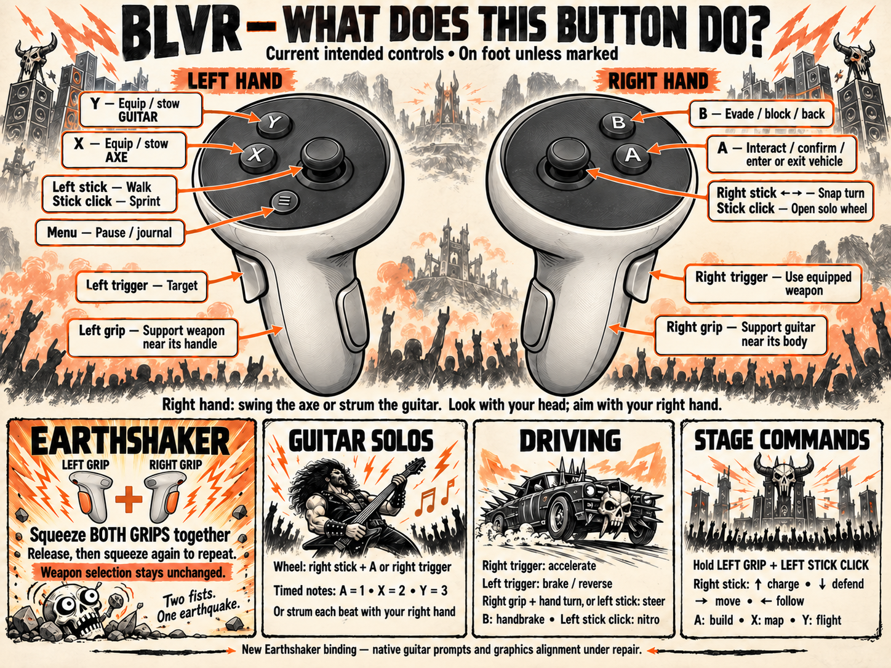

# Brütal Legend VR

A Windows OpenXR mod by Nikami for the Steam PC version of Brütal Legend.
First-person stereo gameplay, tracked Eddie hands and equipment, physical axe
swings and guitar strokes, forearm menus, and guitar-mounted solo UI.

**0.1.0-preview.1 is a testing release.** Simulator and native checks cover the
implemented controls and rendering paths. Physical headset comfort, the
opening mountain ride, exact attack-effect attachment, all shaders, full
campaign behavior, and live stage battles still need verification.

## Install and play

1. Install and launch your legally owned Steam copy of Brütal Legend once.
2. Extract the entire release ZIP into a writable folder outside the game.
3. Run **Setup VR.cmd**, select **BrutalLegend.exe**, and choose **Prepare game**.
4. Connect your headset through its PC OpenXR runtime. Quest Link / Air Link
   with Touch controllers is the current controller profile.
5. Exit any running desktop game, then run **Play VR.cmd**.

The first setup imports Eddie's model, skeleton and textures locally from your
installation. The release contains no retail game assets. Animation uses the
game's current pose at runtime; no idle, walk or attack recording is required.
Keep the extracted folder: the launcher and OpenXR host run from it.

The launcher checks the supported executable before installing the hook.
Existing DLLs are backed up. **Uninstall VR.cmd** restores those files when
their installed hashes still match; your saves and imported model remain.

Supported executable SHA-256:

```text
872dc676e8fd77ad3351dd9dfcc99e89353aae0ed9857272a65fd47f298fb0b1
```

## Controls

| Action | Default |
| --- | --- |
| Walk / snap turn | Left stick / right stick |
| Interact / accept | A |
| Back / evade / block | B |
| Equip or stow axe / guitar | X / Y, on release |
| Attack | Right trigger with a selected weapon, physical axe swing or guitar stroke |
| Target | Left trigger |
| Earthshaker | **Left grip + right grip together**; release before repeating |
| Solo selection | Right stick click; right stick + A / right trigger, or touch the wedge |
| Timed solo notes | A / X / Y, or right-hand strokes on the beat |
| Drive | Right grip + hand turn, or left stick; right trigger gas, left trigger brake |
| Stage commands | Hold left grip + left stick click; right stick orders, A build, Y fly |
| Pause / recenter | Left Menu / left Menu + right stick click |

Run **Remap Controls.cmd** to edit all 51 native game actions and the VR
controls. Choose a row, select an input, and Save. Changes reload during play
within 250 ms. Release held buttons after saving. Invalid edits keep the last
working layout. You can also edit **controls.ini** directly.

Both the game hook and host read the same layout. Native text hints use that
layout; the guitar's timed note display includes a live control legend because
its original A/X/Y artwork stays baked into the game UI. Native contexts and
gameplay locks still determine when an action is available. Overlapping
bindings deliberately activate overlapping actions.

See [complete controls](docs/VR_CONTROLS.md) and
[preview validation and known issues](docs/RELEASE_0.1.0-preview.1.md).



## Troubleshooting

Use the VR launcher to start both processes. If the headset remains blank,
check the connection, wake both controllers, and read
`tools/blvr_xr_host.log` plus the game's `blvr.log`.
For a preflight without launching the game:

```powershell
.\scripts\launch_vr.ps1 -CheckOnly
```

Select another installed 64-bit OpenXR runtime for a launch with
`-RuntimeJson "C:\path\to\runtime.json"`. The launcher uses the registered
system runtime, with a Meta runtime fallback when a simulator is registered.
Other controller profiles are not yet verified.

## Build from source

Install Visual Studio 2022 with Desktop C++ and a Windows SDK, CMake 3.20+,
and Python 3.11+. Clone with submodules:

```powershell
git clone --recursive https://github.com/nikamigaming-create/BrutalLegendVR.git
cd BrutalLegendVR
.\scripts\build.ps1
python -m pip install -r requirements-release.txt
python scripts/blvr_setup.py
```

The hook is x86; the host and setup utility are x64. MinHook is vendored and
OpenXR SDK sources are pinned as a submodule. To package a runtime ZIP, install
the Python dependencies above and run `scripts/package_release.ps1`. Its
optional `-DxvkDll` argument accepts the official DXVK 3.0.2 x86 D3D9 DLL;
the tested release includes that backend.

Original mod code and generated artwork use the MIT license. Dependencies
retain their own licenses; see [third-party notices](THIRD_PARTY_NOTICES.md).
Brütal Legend and its retail content belong to their respective owners.
This is an unofficial mod.
